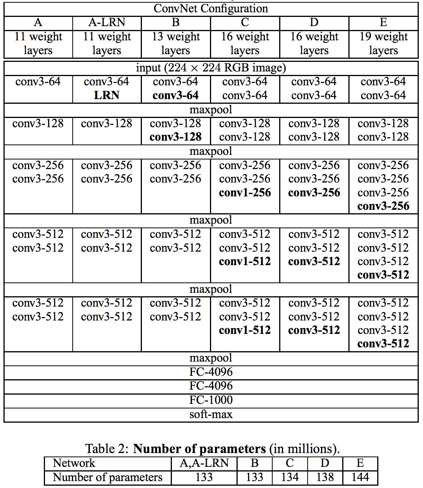
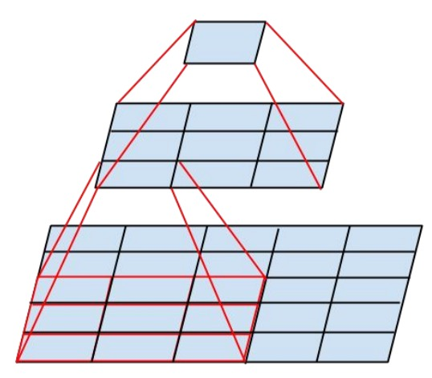
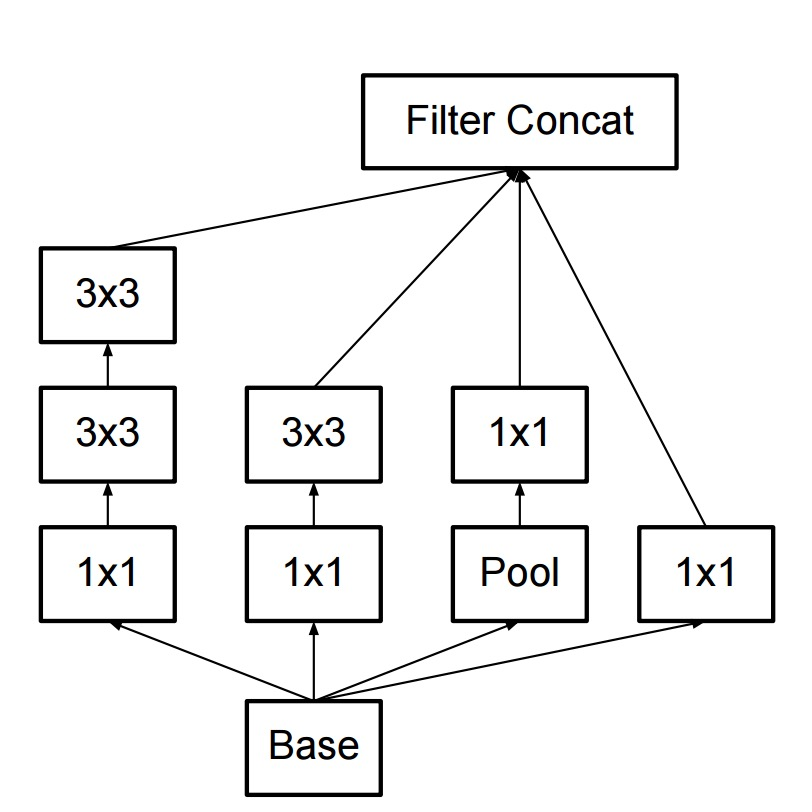
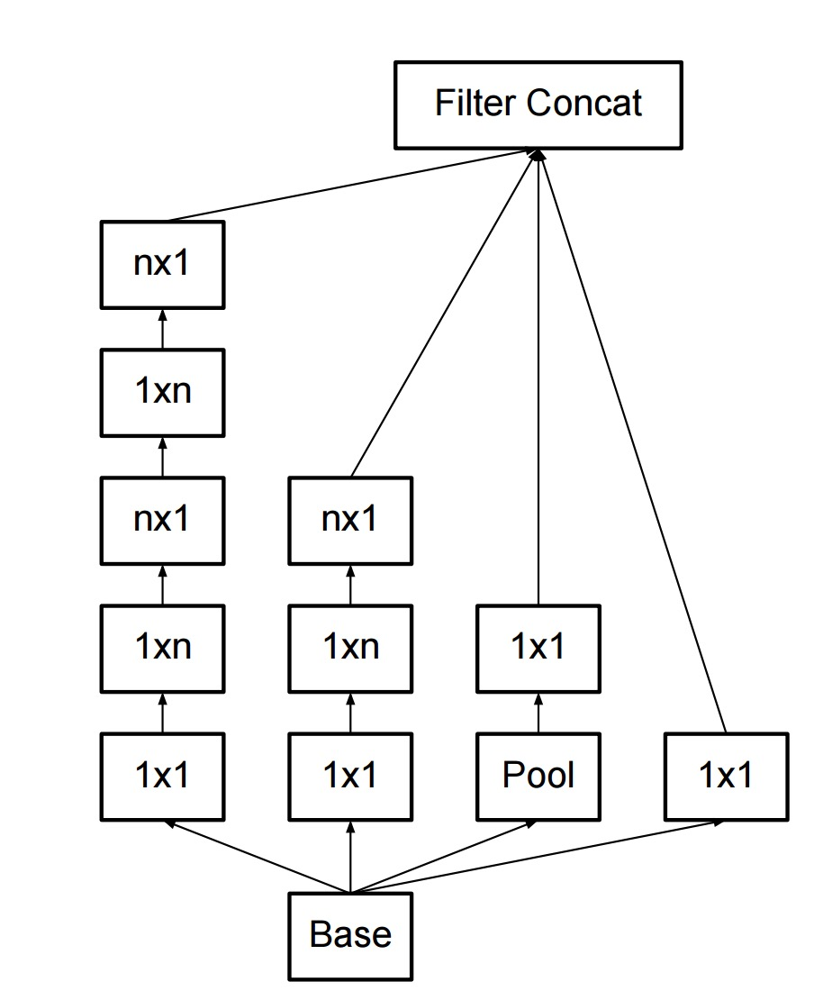
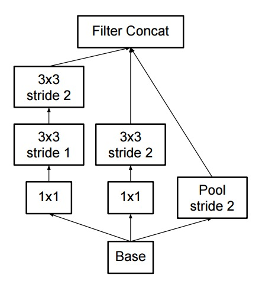
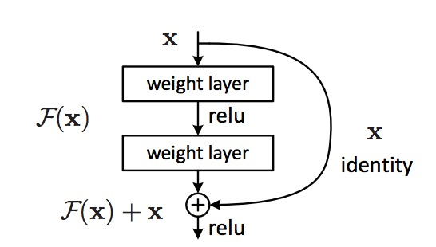
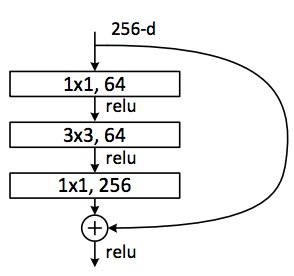

Deep neural networks and Deep Learning are now all the rage. And a lot of their success is careful design of the neural network architecture.

I wanted to revisit the history of neural network design in the last few years and in the context of Deep Learning.

LeNet5
One of the very first convolutional neural netwoks, and what propelled the field of Deep Learning came out in 1998 from Yann LeCun. This was named [LeNet5](http://yann.lecun.com/exdb/publis/pdf/lecun-01a.pdf)

LeNet5 had some very important principles, in particular the insight that image features are distributed across the entire image, and convolutions with learnable parameters are an effective way to extract similar features at multiple location with few parameters. At the time there was no GPU to help training, and even CPUs were slow. Therefore being able to save parameters and computation was a key advantage. This is in contract to using a large neural network operating on each pixel separately, what we now refer to spatial 1x1 convolutions.
LeNet5 feateures can be summarized as:
- convolution of inputs 
- subsampling via averaging
- non-linearity in the form of tanh or sigmoids
- multi-layer neural network (MLP) as final classifier
- sparse connection matrix between layers to avoid large computational cost
In overall this network was the origin of much of the recent architectures, and a true inspiration for many people in the field.

Alexnet
In 2012, Alex Krizhevsky released [AlexNet](https://papers.nips.cc/paper/4824-imagenet-classification-with-deep-convolutional-neural-networks.pdf)
which was a deeper version of the LeNet5 and won by a large margin the difficult ImageNet competition. 

Alexnet scaled the insights of LeNet5 into a much larger neural network that could be used to learn much more complex objects and object hierarchies.
The contribution of this work were:
- use of rectified linear units (ReLU) as non-linearities
- use of dropout technique to selectively ignore feature maps during training, a way to avoid overfitting of the model
- overlapping max pooling, avoinding the averaging effects of average pooling
- use of GPUs [GTX 580](http://www.geforce.com/hardware/desktop-gpus/geforce-gtx-580/specifications) to reduce training time  
At the time GPU offered a much larger number fo cores than CPUs, and allowed 10x faster training time, which in turn allowed to use larger datasts and also bigger images.

VGG
The [VGG networks](http://arxiv.org/abs/1409.1556) from Oxford were the first to use 3x3 filters in each layers and also combined them as a sequence of convolutions. 
This seems to be contrary to the principles of LeNet5, where large convolutions were used to capture similar features in an image. Instead of the 9x9 or 11x11 filters of AlexNet, filters started to become smaller, too dangerously close to the infamous 1x1 convolutions that LeNet5 wanted to avoid. But the great advantage of VGG was the insight that multiple 3x3 convolution in sequence can emulate the effect of larger receptive fields, for examples 5x5 and 7x7. These ideas will be also used in more recent network architectures as Inception and ResNet.

The VGG networks used multiple 3x3 convolutional layers to represent complex features. In some later layer 256x256 and 512x512 3x3 filters are used multiple times to extract more complex features and the combination of such features.
VGG used large feature sizes in many layers and thus inference was quite costly at run-time http://arxiv.org/abs/1605.07678. Reducing the number of feateures, as done in Inception bottlenecks, will save some of the computational cost.

Network-in-network
[Network-in-network](https://arxiv.org/abs/1312.4400) (NiN) had a great insight of using 1x1 convolutions to provide more combinational power to the feateures of a convolutional layers.
The NiN architecture used spatial MLP layers after each convolution, in order to better combine features before another layer. 

The power of MLP can greatly increase the effectiveness of individual convolutional features by combining them into more complex groups. This idea will be later used in most recent architectures as ResNet and Inception and derivatives.
NiN also used an average pooling layer as part of the last classifier, another practice that will become common. This was done to average the response of the network to multiple are of the input image before classification.

GoogleNet and Inception
Christian Szegedy from Google begun a quest on reducing the computational burden of deep neural networks, and devised the [GoogleNet architecture](https://arxiv.org/abs/1409.4842).
By now, Fall 2014, deep learning models were becoming very useful in categorizing the content of images and video frames. As such the internet giants like Google were very interested in efficient deployments of architectures on their server farms.
Christian thought a lot about ways to reduce the computational cost while obtaining state-of-art perfoarmance (on ImageNet, for example). Or be able to keep the computational cost the same, while offering improved performance.
He and his team came up with the Inception module: 

which at a first glance is basically the parallel combination of 1x1, 3x3, and 5x5 convolutional filters. But the great insight of the inception module was the use of 1x1 convolutional blocks (NiN) to reduce the number of feateures before the expensive parallel blocks. This is commonly referred as "bottleneck". Inspired by NiN, the bottleneck was reducing the number of features, and thus operations, at each layer, so the inference time could be kept low.
GoogleNet used a stem without inception modules as initial layers, and an average pooling plus softmax classifier similar to NiN. This classifier is also extremely low number of operations, compared to the ones of AlexNet and VGG. This also contributed to a very efficient network design.

Inception V3
Christian and his team are very efficient. In December 2015 they released a [new version of the Inception modules and the corresponding architecture](http://arxiv.org/abs/1512.00567)
This article better explains the previous GoogleNet and the ideas behind it. A list of ideas are:
- maximize information flow into the network, by carefully constructing network tha balance depth and width. Before each pooling, increase the feature maps.
- when depth is increased, the number of feateures, or width of the layer is also increased systematically
- use width increase at each layer to increase the combination of feateures before next layer
- use only 3x3 convolution, when possible, given that filter of 5x5 and 7x7 can be decomposed with multiple 3x3. See figure:

- the new inception modele thus becomes:

- filters can also be decomposed by [flattened convolutions](http://arxiv.org/abs/1412.5474) into more complex modules:

- inception modules can also decrease the size of the data by provide pooling while performing the inception computation. This is basically identical to performing a convolution with strides in parallel with a simple pooling layer:

Inception still uses a pooling layer plus softmax as final classifier.

ResNet
The revolution then came in December 2015, at about the same time as Inception v3.
[ResNet](https://arxiv.org/abs/1512.03385) have a simple ideas: feed the output of two successive convolutional layer AND the inout again to the next layer! 

This is similar to older ideas like [this one](http://yann.lecun.com/exdb/publis/pdf/sermanet-ijcnn-11.pdf). But here they bypass TWO layers and are applied to large scales.
This is also the very first time that a network of > hundred, even 1000 layers was trained. 
Resnet with a large number of layers started to use a bootleneck layer similar to the Inception bottleneck:

This layer reduces the number of features at each layer by first using a 1x1 convolution with a smaller output (usually 1/4 of the input), and then a 3x3 layer, and then again a 1x1 convolution to a larger number of feateures. Like in the case of Inception modules, this allows to keep the computation low, while providing rich combination of features.
ResNet uses a fairly simple initial layers at the inoput (stem): a 7x7 conv layer followed with a pool of 2. 
ResNet also uses a pooling layer plus softmax as final classifier.
Additional insights about the ResNet architecture are appearing every day:
- ResNet can be seen as both parallel and serial modules, by just thinking of the inout as going to many modules in parallel, while the output of each modules connect in series
- ResNet can also be thought as [multiple ensambles of parallel or serial modules] (http://arxiv.org/abs/1605.06431)
- it has been found that ResNet usually operates on blocks of relatively low depth ~20-30 layers, which act in parallel, rather than serially flow the entire lentght of the network.
- ResNet, when the output is fed back to the input, as in RNN, the network can be seen as a better [bio-plausible model of the cortex](https://arxiv.org/abs/1604.03640)

Inception V4
And Christian and team are at it again with a [new version of Inception](http://arxiv.org/abs/1602.07261):
This time though the solution is, in my opinion, less elegant and more complex, but also full of less transparent heuristics.
In this regard the prize for a clean and simple network that can be easily understood and modified now goes to ResNet.

The future: 

If you are interested in a comparison of neural network architecture and computational performance, see [our recent paper](http://arxiv.org/abs/1605.07678)

Acknowledgments
This writeup was inpisred by the discussion with Abhishek Chaurasia, Adam Paskze, Sangpil Kim, Alfredo Canziani and others in our lab